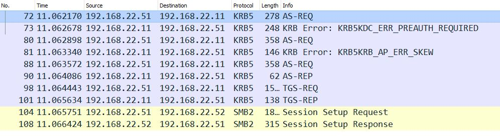

# 230306-AD-Troubleshooting-Workshop

- [230306-AD-Troubleshooting-Workshop](#230306-ad-troubleshooting-workshop)
  - [Useful Tools](#useful-tools)
    - [AutomatdLab](#automatdlab)
    - [ActiveDirectoryManagementFramework (ADMF)](#activedirectorymanagementframework-admf)
    - [LdapTools](#ldaptools)
    - [GPOTools](#gpotools)
    - [NTFSSecurity](#ntfssecurity)
    - [Kerberos.NET](#kerberosnet)
  - [Notes done during the workshop](#notes-done-during-the-workshop)
    - [NTLM](#ntlm)
      - [LMCompatibilityLevel - The Most Misunderstood Windows Security Setting of All Time](#lmcompatibilitylevel---the-most-misunderstood-windows-security-setting-of-all-time)
    - [Kerberos](#kerberos)
      - [Slides](#slides)
      - [Time skew](#time-skew)
      - [Get all Kerberos tickets from all logon sessions](#get-all-kerberos-tickets-from-all-logon-sessions)
      - [Extend Eventlog Entries in PowerShel for working with the actual event data](#extend-eventlog-entries-in-powershel-for-working-with-the-actual-event-data)
    - [AD and AD Replication](#ad-and-ad-replication)
      - [Read Active Directory Replication Metadata](#read-active-directory-replication-metadata)
      - [List all replication site links that do not have a schedule](#list-all-replication-site-links-that-do-not-have-a-schedule)
      - [Add a group membership if a time-to-live](#add-a-group-membership-if-a-time-to-live)
      - [Get all objects created after a certain time](#get-all-objects-created-after-a-certain-time)
      - [How does Active Directory manage the passwords on trust objects?](#how-does-active-directory-manage-the-passwords-on-trust-objects)
  - [PowerShell Desired State Configuration](#powershell-desired-state-configuration)
  - [PowerShell](#powershell)
    - [Win32 functions / DllImport](#win32-functions--dllimport)


## Useful Tools

### [AutomatdLab](https://automatedlab.org/)

[AutomatedLab](https://automatedlab.org/) enables you to setup test and lab environments on Hyper-v or Azure with multiple products or just a single VM in a very short time. There are only two requirements you need to make sure: You need the DVD ISO images and a Hyper-V host or an Azure subscription.

The lab we used during the workshop can be deployed with the sample script [Kerberos 101 Lab - HyperV.ps1](https://github.com/AutomatedLab/AutomatedLab/blob/develop/LabSources/SampleScripts/Workshops/Kerberos%20101%20Lab%20-%20HyperV.ps1).

### [ActiveDirectoryManagementFramework (ADMF)](https://github.com/ActiveDirectoryManagementFramework/ADMF)

Central management module to orchestrate configurations and utilize the various management components that make up the Active Directory Management Framework. This framework can also be used to manage permissions (ACLs) in Active Directory.

### [LdapTools](https://github.com/FriedrichWeinmann/LdapTools)

The LdapTools PowerShell module offers the ability to run ldap queries against Active Directory without the need for the Active Directory module or ADWS. It should offer a significantly improved performance at the loss of some comfort features.

### [GPOTools](https://github.com/FriedrichWeinmann/GPOTools)

The GPOTools module is designed to handle all things GPO. As a special focus, it tries to manage migrations, backup & restore.

### [NTFSSecurity](https://github.com/raandree/NTFSSecurity)

Managing permissions with PowerShell is only a bit easier than in VBS or the command line as there are no cmdlets for most day-to-day tasks like getting a permission report or adding permission to an item. PowerShell only offers Get-Acl and Set-Acl but everything in between getting and setting the ACL is missing. This module closes the gap.

### [Kerberos.NET](https://github.com/dotnet/Kerberos.NET)

A complete Kerberos library for (KDC and Kerberos client) built entirely in managed code without (many) OS dependencies.

## Notes done during the workshop

### NTLM

#### LMCompatibilityLevel - The Most Misunderstood Windows Security Setting of All Time

An interesting read about the LMCompatibilityLevel setting: [The Most Misunderstood Windows Security Setting of All Time](https://learn.microsoft.com/en-us/previous-versions/technet-magazine/cc160954(v=msdn.10)).

### Kerberos

#### Slides

The slides of the Kerberos part are available [here](Assets/Kerberos%20101%20V3.pptx)

#### Time skew

Kerberos does work if the time difference is even more than 24h.



In this case, the KDC sends its time to the client which uses this timestamp to start another request.


The full network trace is [KerberosTimeSkew.pcapng](Assets/KerberosTimeSkew.pcapng).

#### Get all Kerberos tickets from all logon sessions

The command `klist` by default returns the kerberos tickets of the current logon session. Using the parameter `sessions` you can get a list of logon sessions and retrieve the Kerberos ticket information with this command:

```text
klist tickets -li 3e4 -lh 0
```

#### Extend Eventlog Entries in PowerShel for working with the actual event data

[Get-KerberosEncTypes.ps1](https://gist.github.com/raandree/b90e88133861d82deb2b6496ddb3cfc3)

Usage of Cipher Suits:

```text
PS C:\> $Events | Group-Object -Property TicketEncType

Count Name                   
----- ----                   
 1825 AES256_CTS_HMAC_SHA1_96
   62 ARCFOUR_HMAC_MD5
```

List Kerberos Ticket Request Events

```text
PS C:\> $Events | ft UserName, Domain, ClientIpAddress, ServiceName, TicketOptions, TicketEncType

UserName                 Domain   ClientIpAddress      ServiceName                                                          TicketOptions           TicketEncType
--------                 ------   ---------------      -----------                                                          -------------           -------------
KERBCLIENT2$@A.VM.NET    A.VM.NET ::ffff:192.168.22.55 KERBCLIENT2$                             name_canonicalize, renewable, forwardable AES256_CTS_HMAC_SHA1_96
KERBCLIENT2$             A.VM.NET ::ffff:192.168.22.55 krbtgt                     renewable_ok, name_canonicalize, renewable, forwardable AES256_CTS_HMAC_SHA1_96
KERBFILE2$@A.VM.NET      A.VM.NET ::ffff:192.168.22.51 krbtgt          renewable_ok, name_canonicalize, renewable, forwarded, forwardable AES256_CTS_HMAC_SHA1_96
KERBFILE2$@A.VM.NET      A.VM.NET ::ffff:192.168.22.51 KERBFILE2$                               name_canonicalize, renewable, forwardable AES256_CTS_HMAC_SHA1_96
KERBFILE2$               A.VM.NET ::ffff:192.168.22.51 krbtgt                     renewable_ok, name_canonicalize, renewable, forwardable AES256_CTS_HMAC_SHA1_96
KERBFILE2$@A.VM.NET      A.VM.NET ::ffff:192.168.22.51 krbtgt          renewable_ok, name_canonicalize, renewable, forwarded, forwardable AES256_CTS_HMAC_SHA1_96
KERBFILE2$@A.VM.NET      A.VM.NET ::ffff:192.168.22.51 KERBFILE2$                               name_canonicalize, renewable, forwardable AES256_CTS_HMAC_SHA1_96
KERBFILE2$               A.VM.NET ::ffff:192.168.22.51 krbtgt                     renewable_ok, name_canonicalize, renewable, forwardable AES256_CTS_HMAC_SHA1_96
Install@A.VM.NET         A.VM.NET ::ffff:192.168.22.51 KERBDC2$                                                    renewable, forwardable AES256_CTS_HMAC_SHA1_96
Install@A.VM.NET         A.VM.NET ::ffff:192.168.22.51 KERBSQL21$                               name_canonicalize, renewable, forwardable AES256_CTS_HMAC_SHA1_96
Install                  A.VM.NET ::ffff:192.168.22.51 krbtgt                     renewable_ok, name_canonicalize, renewable, forwardable AES256_CTS_HMAC_SHA1_96
Install@A.VM.NET         A.VM.NET ::ffff:192.168.22.51 KERBSQL22$                               name_canonicalize, renewable, forwardable AES256_CTS_HMAC_SHA1_96
Install                  A.VM.NET ::ffff:192.168.22.51 krbtgt                     renewable_ok, name_canonicalize, renewable, forwardable AES256_CTS_HMAC_SHA1_96
KERBFILE2$@A.VM.NET      A.VM.NET ::ffff:192.168.22.51 KERBFILE2$                               name_canonicalize, renewable, forwardable AES256_CTS_HMAC_SHA1_96
KERBFILE2$               A.VM.NET ::ffff:192.168.22.51 krbtgt                     renewable_ok, name_canonicalize, renewable, forwardable AES256_CTS_HMAC_SHA1_96
Install@A.VM.NET         A.VM.NET ::ffff:192.168.22.51 KERBFILE2$                               name_canonicalize, renewable, forwardable AES256_CTS_HMAC_SHA1_96
Install                  A        ::ffff:192.168.22.51 krbtgt                     renewable_ok, name_canonicalize, renewable, forwardable AES256_CTS_HMAC_SHA1_96
KERBSQL22$@A.VM.NET      A.VM.NET ::ffff:192.168.22.53 KERBDC2$                                                    renewable, forwardable AES256_CTS_HMAC_SHA1_96
KERBSQL21$@A.VM.NET      A.VM.NET ::ffff:192.168.22.52 KERBDC2$                                                    renewable, forwardable AES256_CTS_HMAC_SHA1_96
Install@A.VM.NET         A.VM.NET ::ffff:192.168.22.50 KERBDC2$                                                    renewable, forwardable AES256_CTS_HMAC_SHA1_
```

To get information of all Kerberos tickets from all logon sessions, please see [Get-KerberosTickets.ps1](https://gist.github.com/raandree/8f2708ae925ae3d4ecb2e576e5cc2306).

### AD and AD Replication

#### Read Active Directory Replication Metadata

```powershell
$o = Get-ADObject -Identity 'CN=a036564,OU=Finland,OU=Lab Accounts,DC=a,DC=vm,DC=net'
$replData = Get-ADReplicationAttributeMetadata -Object $o -Server KerbDC2 -Properties *
$replData | Sort-Object -Property AttributeName | Format-Table -Property AttributeName, Version, LastOriginatingChangeTime, LastOriginatingChangeDirectoryServerIdentity 
```

#### List all replication site links that do not have a schedule

```powershell
Get-ADReplicationSiteLink -Filter * -Properties schedule | Where-Object { $_.Schedule }
```

#### Add a group membership if a time-to-live

An expiring links feature, which enables time-bound membership in a shadow group. A user can be added to the group for just enough time required to perform an administrative task. The time-bound membership is expressed by a time-to-live (TTL) value that is propagated to a Kerberos ticket lifetime [What's new in Active Directory Domain Services for Windows Server 2016](https://learn.microsoft.com/en-us/windows-server/identity/whats-new-active-directory-domain-services).

```powershell
$ttl = New-TimeSpan -Hours 1
$user = Get-ADUser -Identity a877777
Add-ADGroupMember -Identity 'Domain Admins' -Members $user -MemberTimeToLive $ttl
```

#### Get all objects created after a certain time

The following command lists all AD objects sorted by the USN used while creating the object

```powershell
Get-ADObject -Filter * -Properties uSNCreated | Sort-Object -Property uSNCreated | Format-Table -Property DistinguishedName, uSNCreated
```

You can get the `highestCommittedUSN` with

```powershell
(Get-ADRootDSE).highestCommittedUSN
```

and all objcts with a higher version number like

```powershell
Get-ADObject -Filter { uSNCreated -gt <highestCommittedUSN> } -Properties uSNCreated | ft distinguishedName
```

#### How does Active Directory manage the passwords on trust objects?

[Active Directory Domain Trusts & Trust Password Management](https://adsecurity.org/?p=425).

## PowerShell Desired State Configuration

We did a demo of DSC by creating this simple DSC configuration:

```powershell
 #Imperative
 #Install-WindowsFeature -Name XPS-Viewer

 #Declarative

configuration DcConfig {
    param (
        [Parameter(Mandatory)]
        [string[]]$ComputerName
    )

    Import-DscResource -ModuleName NetworkingDsc, ActiveDirectoryDsc

    node $ComputerName {        

        DnsServerAddress DnsServer {
            InterfaceAlias = 'Kerberos101 0'
            AddressFamily = 'IPv4'
            Address = '192.168.22.11', '192.168.22.10'
        }

        IPAddress ip {
            InterfaceAlias = 'Kerberos101 0'
            AddressFamily = 'IPv4'
            IPAddress = '192.168.22.11'
        }
        
        WindowsFeature InstallXpsViewer {
            Name = 'XPS-Viewer'
            Ensure = 'Present'
        }

        File TestFile1 {
            DestinationPath = 'C:\TestFile1.txt'
            Contents = '123'
            Type = 'File'
        }
    }

}

DcConfig -OutputPath C:\DSC -ComputerName c1, c2, c3

Start-DscConfiguration -Path C:\DSC -Wait -Verbose
```

If you are interested more in this technology, please have a look at the project [DscWorkshop](https://github.com/dsccommunity/DscWorkshop).

## PowerShell

### Win32 functions / DllImport

Using `DllImport` to access Win32 function from PowerShell or C#. A good resource to start is [pinvoke.net](http://pinvoke.net/index.aspx). From there we used the sample code for [DsGetDcName](http://pinvoke.net/default.aspx/netapi32/DsGetDcName.html) and translated it into PowerShell.

```powershell
$code = @'
using System;
using System.Collections.Generic;
using System.ComponentModel;
using System.Linq;
using System.Runtime.InteropServices;
using System.Text;
using System.Threading.Tasks;

namespace Test
{
    public class AD
    {
        [StructLayout(LayoutKind.Sequential, CharSet = CharSet.Unicode)]
        public struct DOMAIN_CONTROLLER_INFO
        {
            [MarshalAs(UnmanagedType.LPTStr)]
            public string DomainControllerName;
            [MarshalAs(UnmanagedType.LPTStr)]
            public string DomainControllerAddress;
            public uint DomainControllerAddressType;
            public Guid DomainGuid;
            [MarshalAs(UnmanagedType.LPTStr)]
            public string DomainName;
            [MarshalAs(UnmanagedType.LPTStr)]
            public string DnsForestName;
            public uint Flags;
            [MarshalAs(UnmanagedType.LPTStr)]
            public string DcSiteName;
            [MarshalAs(UnmanagedType.LPTStr)]
            public string ClientSiteName;
        }

        [DllImport("Netapi32.dll", CharSet = CharSet.Auto, SetLastError = true)]
        public static extern int DsGetDcName
        (
            [MarshalAs(UnmanagedType.LPTStr)]
            string ComputerName,
            [MarshalAs(UnmanagedType.LPTStr)]
            string DomainName,
            [In] int DomainGuid,
            [MarshalAs(UnmanagedType.LPTStr)]
            string SiteName,
            [MarshalAs(UnmanagedType.U4)]
            DSGETDCNAME_FLAGS flags,
            out IntPtr pDOMAIN_CONTROLLER_INFO
        );

        [DllImport("Netapi32.dll", SetLastError = true)]
        public static extern int NetApiBufferFree(IntPtr Buffer);

        [Flags]
        public enum DSGETDCNAME_FLAGS : uint
        {
            DS_FORCE_REDISCOVERY = 0x00000001,
            DS_DIRECTORY_SERVICE_REQUIRED = 0x00000010,
            DS_DIRECTORY_SERVICE_PREFERRED = 0x00000020,
            DS_GC_SERVER_REQUIRED = 0x00000040,
            DS_PDC_REQUIRED = 0x00000080,
            DS_BACKGROUND_ONLY = 0x00000100,
            DS_IP_REQUIRED = 0x00000200,
            DS_KDC_REQUIRED = 0x00000400,
            DS_TIMESERV_REQUIRED = 0x00000800,
            DS_WRITABLE_REQUIRED = 0x00001000,
            DS_GOOD_TIMESERV_PREFERRED = 0x00002000,
            DS_AVOID_SELF = 0x00004000,
            DS_ONLY_LDAP_NEEDED = 0x00008000,
            DS_IS_FLAT_NAME = 0x00010000,
            DS_IS_DNS_NAME = 0x00020000,
            DS_RETURN_DNS_NAME = 0x40000000,
            DS_RETURN_FLAT_NAME = 0x80000000
        }
    }
}
'@

Add-Type -TypeDefinition $code

$ERROR_SUCCESS = 0;
[IntPtr]$pDCI = [IntPtr]::Zero

try {
    $flags = [Test.AD+DSGETDCNAME_FLAGS]::DS_DIRECTORY_SERVICE_REQUIRED -bor [Test.AD+DSGETDCNAME_FLAGS]::DS_RETURN_DNS_NAME -bor [Test.AD+DSGETDCNAME_FLAGS]::DS_IP_REQUIRED
    $val = [Test.AD]::DsGetDcName('', '', 0, '', $flags, [ref]$pDCI);
        
    if ($ERROR_SUCCESS -eq $val)
    {
        $domainInfo = [Test.AD+DOMAIN_CONTROLLER_INFO][System.Runtime.InteropServices.Marshal]::PtrToStructure($pDCI, [type][Test.AD+DOMAIN_CONTROLLER_INFO])

        Write-Host "Forest: $($domainInfo.DnsForestName)"
        Write-Host "DC-Site: $($domainInfo.DomainControllerName)"
        Write-Host "Client: $($domainInfo.ClientSiteName)"
    }
    else
    {
        $ex = [System.ComponentModel.Win32Exception]::new($val)
        Write-Error -Exception $ex
    }
}
finally
{
    [Test.AD]::NetApiBufferFree($pDCI)
}

$domainInfo
```
